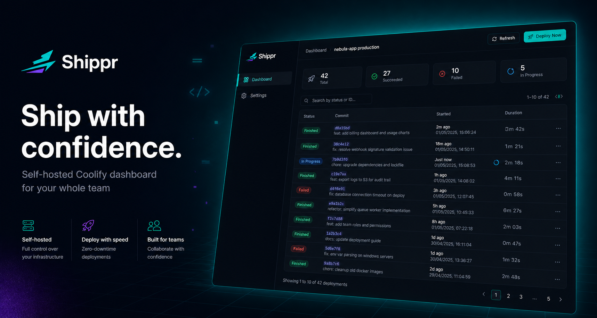

# Shippr



**Shippr is a self-hosted web dashboard built specifically for [Coolify](https://coolify.io).** It gives your team a clean, access-controlled interface to watch deployment logs in real time, trigger deploys, and browse deployment history — without handing everyone your Coolify credentials or root access.

> Built for teams running Coolify who need fine-grained visibility and per-user access control on top of it.

---

## Why Shippr

Coolify is a great self-hosted platform, but its built-in UI gives full access to whoever you invite. Shippr sits in front of Coolify and adds:

- **Per-user project access** — assign team members to only the Coolify projects they should see
- **Live deployment logs** — watch builds stream in real time without leaving the dashboard
- **One-click deploys** — trigger a deployment from the UI instead of digging into Coolify
- **Deployment history** — paginated history for every app with status, duration, and log access
- **Google sign-in** — no passwords; team members sign in with their Google account
- **Domain restriction** — optionally lock sign-in to your company's email domain

---

## How it works

Shippr connects to your Coolify instance via its API. It syncs your projects, apps, and services into a local database every 10 minutes, so the UI is always fast. When a team member opens it, they only see the projects you've assigned to them. Deployment logs are fetched directly from Coolify on demand and streamed to the browser via HTTP polling.

```
Browser  ──(Google sign-in)──▶  Firebase Auth
   │
   │  Bearer token
   ▼
Shippr Server
   ├── verifies token with Firebase Admin SDK
   ├── checks user's project access (local DB)
   └── proxies requests to Coolify API
                                    │
                                    ▼
                             Your Coolify Instance
```

One Docker container runs the whole thing — the server also serves the frontend as static files.

---

## Deploy

**→ [Full Docker deployment guide](docs/DEPLOY.md)**

The quick version:

```bash
# 1. Create your .env (see docs/DEPLOY.md for all variables)
cp .env.example .env && nano .env

# 2. Run
docker run -d \
  --name shippr \
  --restart unless-stopped \
  -p 3069:3069 \
  -v shippr_data:/app/data \
  --env-file .env \
  arpanagr/shippr:latest
```

Or with Docker Compose:

```yaml
# docker-compose.prod.yml
services:
  shippr:
    image: arpanagr/shippr:latest
    restart: unless-stopped
    ports:
      - "3069:3069"
    volumes:
      - shippr_data:/app/data
    env_file: .env

volumes:
  shippr_data:
```

```bash
docker compose -f docker-compose.prod.yml up -d
```

Sign in with your `SUPER_ADMIN_EMAIL` account on first launch to get admin access, then use **User Management** to assign team members to projects.

---

## Prerequisites

- A running [Coolify](https://coolify.io) instance (self-hosted)
- Docker on the machine where you'll run Shippr
- A free [Firebase](https://firebase.google.com) project (for Google sign-in)

See [docs/DEPLOY.md](docs/DEPLOY.md) for step-by-step Firebase setup and all configuration options.

---

## Environment Variables

| Variable | Required | Description |
|---|---|---|
| `COOLIFY_URL` | Yes | Base URL of your Coolify instance |
| `COOLIFY_TOKEN` | Yes | Coolify API token |
| `PORT` | No | Port to listen on (default `3069`) |
| `FIREBASE_PROJECT_ID` | Yes | Firebase project ID |
| `FIREBASE_CLIENT_EMAIL` | Yes | Firebase Admin SDK service account email |
| `FIREBASE_PRIVATE_KEY` | Yes | Firebase Admin SDK private key |
| `SUPER_ADMIN_EMAIL` | Yes | Email auto-promoted to super-admin on first login |
| `ALLOWED_EMAIL_DOMAIN` | No | Restrict sign-in to this domain, e.g. `acme.com`. Empty = any Google account |
| `DB_PROVIDER` | No | `sqlite` (default), `mysql`, or `postgresql` |
| `DATABASE_URL` | No | Prisma connection URL. Default: `file:./data/shippr.db` |
| `FIREBASE_API_KEY` | Yes | Firebase Web SDK API key |
| `FIREBASE_AUTH_DOMAIN` | Yes | Firebase Auth domain |
| `FIREBASE_STORAGE_BUCKET` | Yes | Firebase storage bucket |
| `FIREBASE_MESSAGING_SENDER_ID` | Yes | Firebase messaging sender ID |
| `FIREBASE_APP_ID` | Yes | Firebase web app ID |
| `GOOGLE_HD` | No | Domain hint on the Google sign-in picker |

---

## User Management

1. Have team members sign in once (creates their account in Shippr)
2. Open **User Management** (top-right menu, super-admin only)
3. Assign each user to one or more Coolify **projects**
4. They will only see apps and services within those projects
5. Promote to admin if they need to manage other users

---

## Development

Requires Docker and Docker Compose. No local Node.js needed.

```bash
cp .env.example .env
# fill in .env

docker compose up --build
```

| Service | URL |
|---|---|
| Client (Vite + HMR) | http://localhost:5173 |
| Server (nodemon) | http://localhost:3069 |

Source files are volume-mounted — changes to `client/src/` and `server/src/` reload automatically.

```bash
# Stop the stack
docker compose down

# Tail logs
docker compose logs -f server
docker compose logs -f client
```

---

## Tech Stack

| | |
|---|---|
| Frontend | React 18, TypeScript, Vite, Tailwind CSS, shadcn/ui |
| Backend | Node.js, Express, TypeScript |
| Auth | Firebase Auth (Google sign-in) + Firebase Admin SDK |
| Database | Prisma ORM — SQLite by default, MySQL / PostgreSQL supported |
| Infra | Docker, Docker Compose |

---

## License

Free to use and modify for personal and commercial purposes. Attribution must be kept. Selling Shippr itself as a product or hosted platform is not permitted. See [LICENSE](LICENSE) for the full terms.
